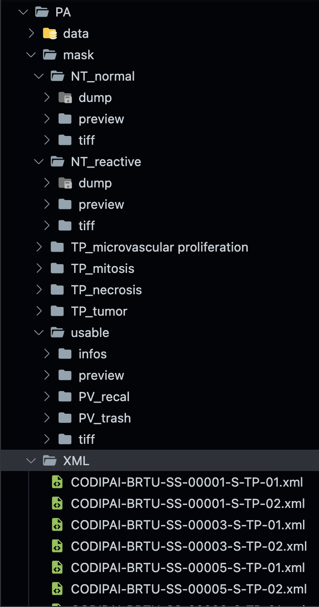

# EfficientUNet++

[](https://arxiv.org/abs/2106.11447) [](https://shields.io/)

   - June 23/2021: Initial PyTorch code release for [EfficientUNet++](https://arxiv.org/abs/2106.11447)

## 1. About the EfficientUNet++ decoder architecture

The [EfficientUNet++](https://arxiv.org/abs/2106.11447) is a decoder architecture inspired by the [UNet++](https://arxiv.org/abs/1807.10165). Although it was designed and fine-tuned for a coronary artery segmentation task, we expect it to perform well across a wide variety of medical image segmentation tasks. We plan to test it on other tasks soon, and will upload test set performance when we do.

In our coronary artery segmentation task, using [EfficientNet](https://arxiv.org/abs/1905.11946) models as backbone, the EfficientUNet++ achieves higher performance that the UNet++, [U-Net](https://arxiv.org/abs/1505.04597), [ResUNet++](https://arxiv.org/abs/1911.07067) and other high-performing medical image segmentation architectures. Such improvement is achieved by two simple modifications, inspired by the EfficientNet building blocks:

  - To reduce computation, the 3x3 convolutional blocks of the UNet++ are replaced with residual bottleneck blocks with depthwise convolutions
  - To enhance performance, the feature maps outputted by 3x3 depthwise convolution are processed by an [scSE](https://arxiv.org/abs/1803.02579), that applies both channel and spatial attention. The SE channel attention used in the EfficientNet was tested, but yielded worse results. For more details, refer to the [paper](https://arxiv.org/abs/2106.11447).

Comparison of the EfficientUNet++ and UNet++ building blocks:

<div align="center">

</div>
   
Performance of different decoder architectures as a function of the number of FLOPS and the number of parameters, when using the EfficientNet B0 to B7 models as encoders:

<div align="center">

</div>
   
To help practicioners choose the most adequate model for their clinical needs and available hardware, the Pareto Frontier of the tested models was drawn, with the number of FLOPS as a function of model performance.

<div align="center">


   
</div>

## 2. Installing the repository

xmltodict로 XML 파싱 해야함 .. `pip install xmltodict` 설치

When installing the repository, do not forget to update the submodule, by running the `git submodule update --init --recursive` command.

## 3. Using the EfficientUNet++ independently

The EfficientUNet++ was implemented as an extension of the Segmentation Models Pytorch repository, by [Pavel Yakubovskiy](https://github.com/qubvel). Currently, it is a pending pull request. For detailed information on library installation and model usage, visit the [Read The Docs Project Page](https://segmentation-models-pytorch.readthedocs.io/en/latest/) or the [repository's README](https://github.com/jlcsilva/segmentation_models.pytorch/blob/master/README.md). 


## 3-1 데이터 배치하기

데이터 구조는 다음과 같아야 한다.



```bash
python get_images_info.py --data-img-location ../PA/mask --data-xml-location ../PA/XML
```
```bash
python get_image_batches.py --data-img-location ../PA/mask --data-save-location ../PA/data --img-pd-path ./images.pickle --map-pd-path ./mapper.pickle
```

## 4. Training the EfficientUNet++

It was not possible to obtain the necessary clearances to release the full coronary artery segmentation dataset. Therefore, to enable other researchers and programmers to test our architecture, we provide a toy dataset with 6 coronary angiography images, and built a loader for the the retinal vessel segmentation [DRIVE](https://drive.grand-challenge.org/) dataset. We still haven't had the time to test the EfficientUNet++ in the retinal vessel segmentation task, but we expect it to perform well when coupled with the right encoder.

To train the an EfficientUNet++ model on the coronary artery segmentation toy dataset using the EfficientNetB0 encoder, run:

```
  python train.py \
    -mp "MAPPER_PATH" \
    -ti "TRAIN_IMG_PATH (have to same structure...: ..{PATH_TO_TRAIN_IMG}/imgs)" \
    -tm "TRAIN_MASK_PATH (have to same structure...: ..{PATH_TO_TRAIN_MASK}/masks)" \
    -vi "VALID_IMG_PATH (have to same structure...: ..{PATH_TO_VALID_IMG}/imgs)"\
    -vm "VALID_MASK_PATH (have to same structure...: ..{PATH_TO_VALID_MASK}/masks)" \
    -l LearningRate \
    -enc "timm-efficientnet-b0" {timm-efficientnet-b0, timm-efficientnet-b1, ..., timm-efficientnet-b7}\
    -e EPOCH \
    -b BATCH
```

To consult the available encoder architectures, visit the [Read The Docs Project Page](https://segmentation-models-pytorch.readthedocs.io/en/latest/). 

## 5. Inference

To perform inference, run the following command:

```
  python predict.py \
    --mapper ../CODIPAI/PA/mapper.pickle \
    -m "CHECKPOINT_FILE_PATH" \
    --enc "timm-efficientnet-b0"  {timm-efficientnet-b0, timm-efficientnet-b1, ..., timm-efficientnet-b7}\ \
    --img-path {PATH_TO_IMG} \
    --predict-mask-path {PATH_TO_SAVE} \
```

where the dataset can be either Coronary or DRIVE.

## 6. Citing 📝

If you find our work useful and use it or draw inspiration from it in your research, please consider citing it.

```
@misc{silva2021encoderdecoder,
      title={Encoder-Decoder Architectures for Clinically Relevant Coronary Artery Segmentation}, 
      author={João Lourenço Silva and Miguel Nobre Menezes and Tiago Rodrigues and Beatriz Silva and Fausto J. Pinto and Arlindo L. Oliveira},
      year={2021},
      eprint={2106.11447},
      archivePrefix={arXiv},
      primaryClass={eess.IV}
}
```

## 6. License 🛡️

Distributed under [MIT License](https://github.com/jlcsilva/EfficientUNetPlusPlus/blob/main/LICENSE)
